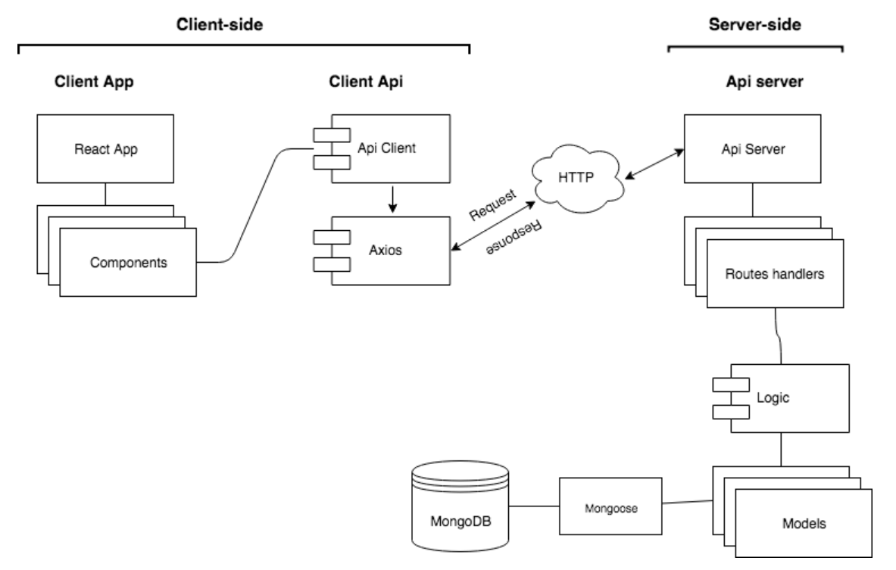

# FURNITURE APP 1.0.0

### TARGET
E-comerce web platform focused on the sale of furniture for inside and outside our homes.

### USER CASES

### DATA MODEL

### BLOCK MODEL

### Technologies

Uses html, css3, Javascript, React, Express, Node, Mongoose and Mongo, also uses libraries as axios, jsonwebtoken, expect or chai.

### SCREENSHOTS

#### Landing

#### Login

#### Register

#### Cart

#### Order

#### Products

